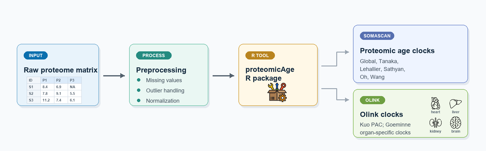
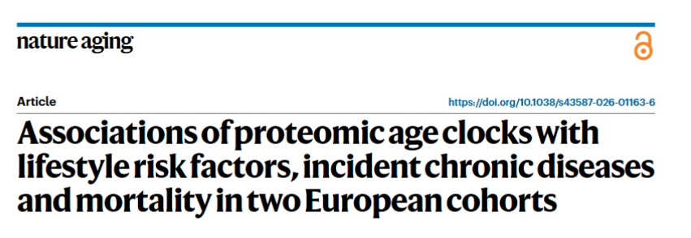
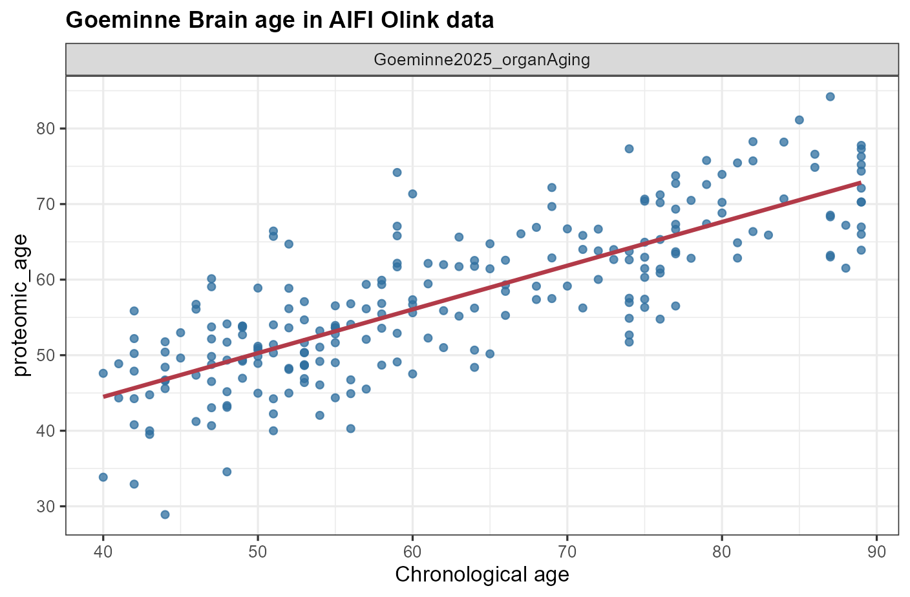
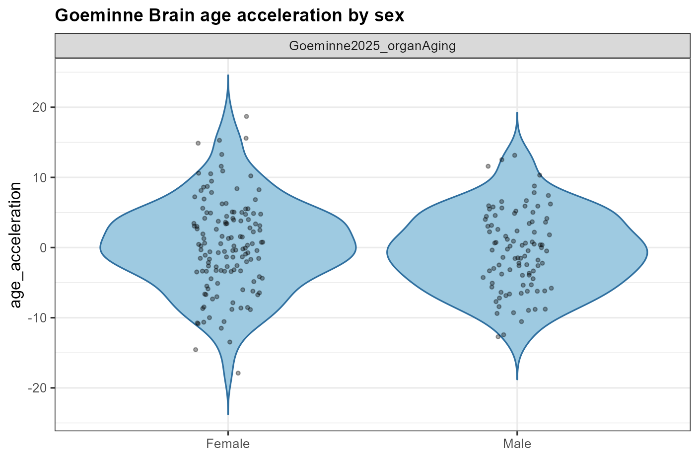

# proteomicAge

Compute biological age from plasma proteomic data using published proteomic
aging clocks, including the **Global proteomic age ensemble**.



**Contributed by:** Han Xiao (hx624@ic.ac.uk), Esther Herrera.

## Installation

```r
remotes::install_github("EnricMartin/proteomicAge")
```

## Supported Clocks

| Clock | Function | Proteins | Platform | Sex Required |
|-------|----------|----------|----------|--------------|
| **Global proteomic age** | `compute_global_age()` | Ensemble of five clocks | SomaScan | Yes, recommended |
| Tanaka 2018 | `compute_tanaka2018_age()` | 76 | SomaScan | No |
| Lehallier 2019 | `compute_lehallier2019_age()` | 373 | SomaScan | No |
| Sathyan 2020 | `compute_sathyan2020_age()` | 162 | SomaScan | No |
| Oh 2023 conventional | `compute_oh2023_conventional_age()` | 4,778 | SomaScan | **Yes** |
| Wang 2024 ARIC midlife | `compute_wang2024_aric_age()` | 788 | SomaScan | No |
| Kuo 2024 PAC | `compute_kuo2024_pac_age()` | 128 + age | Olink | No |
| Goeminne organAging | `compute_goeminne2025_organ_age()` | Organ-specific | Olink | No |

**Global proteomic age was developed from the Nature Aging study shown below.**

[](https://doi.org/10.1038/s43587-026-01163-6)

The package does **not** transform protein abundances inside clock prediction
functions. Please preprocess your protein matrix before calling a clock.
`preprocess_somascan()` is provided for explicit SomaScan preprocessing.
Olink clocks expect NPX-scale Olink values.

## Input Format

The input data frame should contain one row per sample, sample metadata columns,
and one column per protein.

| Column | Required | Description | Example |
|--------|----------|-------------|---------|
| Sample ID | Yes | Unique sample identifier; name is set with `id_col` | `"P001"` |
| Age | Yes | Chronological age in years; name is set with `age_col` | `50` |
| Sex | Clock-dependent | Required for Oh; strongly recommended for Global Age because it includes Oh | `0`, `1`, `"Male"`, `"Female"` |
| Group | Optional | Grouping variable for QC, scatter, and violin outputs | `"Male"`, `"Female"` |
| Protein columns | Yes | Protein abundances named with one supported convention | `GDF15`, `P15692`, `seq.11104.13.3` |

Supported protein naming conventions:

| `match_by` value | Example | Description |
|------------------|---------|-------------|
| `uniprot` | `P36222`, `Q99988` | UniProtKB accession |
| `gene` | `CHI3L1`, `GDF15` | Gene symbol |
| `seqid_dot` | `seq.11104.13.3`, `11104.13.3` | SomaScan dot-format SeqId |
| `seqid_sl` | `SL003340`, `SL003869` | SomaScan legacy SL-format SeqId |

Use `detect_format()` to infer the naming convention from protein columns, or
pass `match_by` explicitly.

## Quick Start

### SomaScan Example

```r
library(proteomicAge)

dat <- read.csv("my_somascan_data.csv", check.names = FALSE)

protein_cols <- setdiff(names(dat), c("SampleID", "Age", "Sex", "Group"))
fmt <- detect_format(protein_cols)

dat_processed <- preprocess_somascan(
  dat,
  protein_cols = protein_cols,
  transform = "log2",
  handle_outliers = TRUE
)

tanaka <- compute_tanaka2018_age(
  dat_processed,
  id_col = "SampleID",
  age_col = "Age",
  match_by = fmt,
  group = "Group"
)

tanaka$predictions
tanaka$qc
tanaka$scatter_plot
tanaka$group_plot
tanaka$group_comparison
```

### Olink Example

```r
pac <- compute_kuo2024_pac_age(
  olink_wide_uniprot,
  id_col = "SampleID",
  age_col = "Age",
  group = "Sex"
)

pac$predictions
pac$qc
pac$scatter_plot
pac$group_plot
pac$group_comparison
```

## AIFI Olink Demo

Download the Allen Institute AIFI long-format Olink file from:
https://apps.allenimmunology.org/aifi/insights/dynamics-imm-health-age/downloads/olink/

The example below converts that file to a UniProt wide table and computes the
Goeminne second-generation Olink Brain age with sex-based plots.

```r
library(proteomicAge)
library(dplyr)
library(tidyr)

immune_olink <- read.csv(
  "path/to/imm-of-aging_all_olink.csv",
  check.names = FALSE
)

olink_wide_uniprot <- immune_olink %>%
  transmute(
    SampleID = sample.sampleKitGuid,
    Age = as.numeric(gsub("[+]$", "", as.character(sample.subjectAgeAtDraw))),
    Sex = subject.biologicalSex,
    uniprot = olink.uniprot_id,
    npx_raw = as.numeric(olink.NPX_raw)
  ) %>%
  filter(!is.na(uniprot), uniprot != "") %>%
  group_by(SampleID, Age, Sex, uniprot) %>%
  summarise(
    value = if (all(is.na(npx_raw))) NA_real_ else mean(npx_raw, na.rm = TRUE),
    .groups = "drop"
  ) %>%
  pivot_wider(names_from = uniprot, values_from = value)

protein_cols <- setdiff(names(olink_wide_uniprot), c("SampleID", "Age", "Sex"))
olink_wide_uniprot <- olink_wide_uniprot[, c(
  "SampleID", "Age", "Sex",
  protein_cols[colSums(!is.na(olink_wide_uniprot[protein_cols])) > 0]
)]

goeminne_brain <- compute_goeminne2025_organ_age(
  olink_wide_uniprot,
  id_col = "SampleID",
  age_col = "Age",
  organs = "Brain",
  model_type = "chronological",
  fold = 1,
  match_by = "uniprot",
  group = "Sex"
)

head(goeminne_brain$predictions)
goeminne_brain$qc
goeminne_brain$scatter_plot
goeminne_brain$group_plot
goeminne_brain$group_comparison
```

<table>
  <tr>
    <td></td>
    <td></td>
  </tr>
</table>

## Output

When `group` is omitted, `compute_*_age()` functions return the original
prediction data frame:

| Column | Description |
|--------|-------------|
| `id` | Sample identifier |
| `chronological_age` | Input age |
| `proteomic_age` | Predicted biological age |
| `age_acceleration` | Residual from `lm(proteomic_age ~ chronological_age)` |
| `n_proteins_matched` | Number of clock proteins found in the input data |
| `n_proteins_missing` | Number of clock proteins not found in the input data |
| `match_by` | Protein naming convention used for matching |

When `group` is supplied, or `return_list = TRUE`, each compute function returns
a list:

| Element | Description |
|---------|-------------|
| `predictions` | Standard prediction data frame |
| `qc` | One-row QC summary for the clock output |
| `scatter_plot` | ggplot object for proteomic age versus chronological age |
| `group_plot` | ggplot violin plot by the selected group |
| `group_comparison` | Welch t-test summary for two-level groups |
| `group` | Group vector matched to prediction rows |

The standalone helpers `summarize_clock_qc()`, `clock_correlation_matrix()`,
`plot_clock_scatter()`, and `plot_clock_violin()` are still available for custom
workflows.

## Protein Utilities

```r
tanaka2018_proteins()
lehallier2019_proteins()
sathyan2020_proteins()
oh2023_conventional_proteins()
wang2024_aric_proteins()
kuo2024_pac_proteins()
goeminne2025_organaging_proteins()
olink_protein_map()
```

Convert protein column names when needed:

```r
dat_uniprot <- convert_format(
  dat,
  target_format = "uniprot",
  id_col = "SampleID",
  age_col = "Age"
)
```

## Citation

```text
Tanaka T, Biancotto A, Moaddel R, Moore AZ, Gonzalez-Freire M, Aon MA,
Candia J, Zhang P, Cheung F, Fantoni G, Semba RD, Ferrucci L.
Plasma proteomic signature of age in healthy humans.
Aging Cell. 2018;17(5):e12799. doi:10.1111/acel.12799.

Lehallier B, Gate D, Schaum N, Nanasi T, Lee SE, Yousef H, Moran Losada P,
Berdnik D, Keller A, Verghese J, Sathyan S, Franceschi C, Milman S,
Barzilai N, Wyss-Coray T.
Undulating changes in human plasma proteome profiles across the lifespan.
Nature Medicine. 2019;25:1843-1850. doi:10.1038/s41591-019-0673-2.

Sathyan S, Ayers E, Gao T, Weiss EF, Milman S, Barzilai N, Verghese J.
Plasma proteomic profile of age, health span, and all-cause mortality in
older adults. Aging Cell. 2020;19(11):e13250. doi:10.1111/acel.13250.

Oh HS, Rutledge J, Nachun D, et al.
Organ aging signatures in the plasma proteome track health and disease.
Nature. 2023;624:164-172. doi:10.1038/s41586-023-06802-1.

Wang S, Rao Z, Cao R, et al.
Development, characterization, and replication of proteomic aging clocks:
analysis of 2 population-based cohorts.
PLOS Medicine. 2024;21(9):e1004464. doi:10.1371/journal.pmed.1004464.

Kuo CL, Chen Z, Liu P, Pilling LC, Atkins JL, Fortinsky RH, Kuchel GA,
Diniz BS. Proteomic aging clock (PAC) predicts age-related outcomes in
middle-aged and older adults.
Aging Cell. 2024;23(8):e14195. doi:10.1111/acel.14195.

Goeminne LJE, Vladimirova A, Eames A, Tyshkovskiy A, Argentieri MA,
Ying K, Moqri M, Gladyshev VN.
Plasma protein-based organ-specific aging and mortality models unveil diseases
as accelerated aging of organismal systems.
Cell Metabolism. 2025;37(1):205-222.e6. doi:10.1016/j.cmet.2024.10.005.

Robinson O, et al.
Associations of proteomic age clocks with lifestyle risk factors, incident
chronic diseases and mortality in two European cohorts.
Nature Aging. 2026. doi:10.1038/s43587-026-01163-6.
```

## License

MIT
